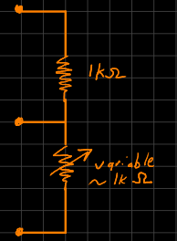
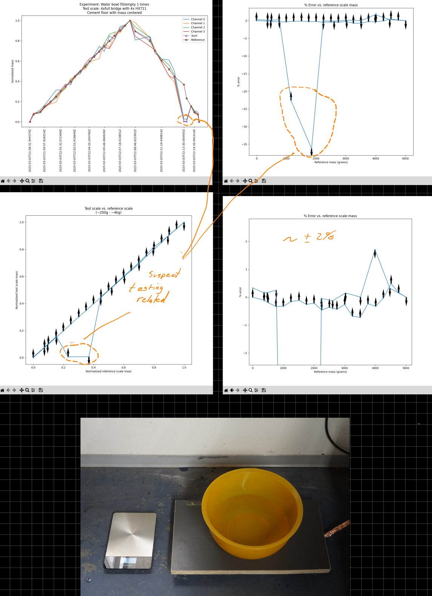

Load Cell Scale (March 2025)
============================
An exploration was made into using load cells as a means for mass measurement in an
agricultural context.

Distributed Full Bridge Scale
-----------------------------
A distributed Wheatstone bridge load cell scale was constructed. Four "E-block" load cells were
utilized along with the HX711 board for amplification and analog to digital conversion.

Example:

(Image source: `link <load_cell_img_src_>`_)

Each load cell is half a bridge, with one reference resistor and one resistor that varies under
strain. Here is what it looks like electrically:

Here is what the full distributed bridge looks like electrically, using four half bridge load cells:

Here is a picture of the installation on a 10"x20" gardening tray:

A water fill test was performed:

Here is a ref/test scale output over time:

Error plot:

Notice that the error is very high at lighter loads. Particularly after the bowl is filled once.
It was discovered that the flexing of the base on which the distributed bridge scale as installed
was causing the high error.

.. note:: The arrows on the plots indicate whether the bowl is being filled or emptied with water.

Distributed Full Bridge Scale With Improved Platform
----------------------------------------------------
A platform made out of structurally stiff particle board was created to minimize the flexing
effect discovered.

Here is the data that was collected from a water fill test:

This data looks very good. The linearity and the error rate are excellent.

However, there was a problem that was discovered. Although this scale is very accurate and
sensitive, it is also very sensitive to any irregularities in surface on which is it sitting. It
is not tolerant of out of level conditions. Because of this, it was decided that this design
would not be suitable for a containerized agricultural context. Plants are grown in containers on
many varied surfaces. From wire racks, to haphazardly built shelving/tables to sitting on the dirt.

4xFull Bridge Scale
-------------------
To address the sensitivity of the distributed full bridge scale design. A new design was
implemented to integrate four independent full bridge scales. The sum of which provides the mass
of the system. This design is intended to work on varied terrain and non-uniformly distributed
loads. Both of which are commonplace in a containerized gardening context.

Two half-bridge load cells were placed back to back so that one variable resistor would increase
with load and one resistor would decrease with load. Electrically, it looks like this:

Here is the assembly one of the four points of the scale system:

Here is data taken during a water fill test:

The data looks promising. Linearity is acceptable and the error rate is +/- 3% over the expected
mass range.

Next, four full bridge point scales were installed onto particle board.

Initially, the electrical was implemented as:

However, it was discovered that the MUX was causing a very long (~3 second) settling time when
switching between load points. Root cause was not fully found, but the leading hypothesis is that
the intrinsic resistance (~75 ohms) through the mux was causing insufficient input current into the
HX711 opamp.

The electrical design was changed to this:

This design implements four HX711 boards, one for each load cell point.

Four experiments were conducted

1. Cement Floor with centered mass

A bowl was placed near the center of the platform. It was then filled with known masses of water
and then emptied with known masses of water.

The results look good. The summed mass is within +/- 2% error.

2. Cement floor with offset mass

A bowl was placed centered over the four load cell points. Each point was selected in a round
robin fashion with each sample during the experiment.

The data looks good here too. the error is +/- 4% over the expected load range (0-5kg).

3. Flexible metal shelf with centered mass

The scale was placed on a flexible metal shelf. This shelf is not sturdy, but is quite flexible
under load. A water fill experiment was conducted with the bowl being placed near the center of
the platform.

The data looks good here. The error is +/- 1% or less.

4. Grow box with janky slat shelving with offset mass

The scale was then placed inside a grow box with janky slat shelving. The bowl was moved round
robin over the load cell points with each sample. Here is the data:

As shown in the plots, it was found that one of the load cell points was not in contact with the
shelving in the grow box. This resulted in bogus data being sent on the associated channel.

To remedy this in the future, care should be taken to ensure that all four load cell points are
in contact with the surface.

Secondly, a means to detect a lifted load point could be created. At calibration time, the
value of the load point at zero load could be measured and retained. If the load point is reading
at this value, then it could be assumed that it is not in contact with the surface. The mass of
the system could then be calculated by summing the load points that are in contact with the
surface.

Growing Data
~~~~~~~~~~~~
A tray of lettuce was grown while taking mass measurements via the 4xfull-bridge prototype. Here
is a picture taken following a 160 gram harvest:

Here is the scale data over about nine days. The data is a bit noisy due to noise on the serial
lines that will be fixed in the next prototype.

Here is a close up of the summed channel data with interesting features labeled.

More close ups:

It is interesting to see the jagged signal on harvest. This is due to the time it took and the
method to harvest; i.e. a pocket knife and careful cutting.

Summary:
Although the data is noisy, this will be fixed in future prototypes. The signal for
watering is clear and strong. The harvest is also great to see. Unexpectedly, insights into how
the plant uptakes water with the lights on/off was observed. The rate of mass loss with the
lights off is lower than with the lights on. This indicates that the lettuce plants up-take and
effervesce water more with the lights on. Likely, this can be correlated to plant growth in
future data analyses.

.. _load_cell_img_src: https://www.amazon.com/Wishiot-Weighing-Half-Bridge-Bracket-Amplifier/dp/B0DCK48BSK/ref=sr_1_1_pp?crid=1M4SCPQH7IHNL&dib=eyJ2IjoiMSJ9.H2BGsNLxWSujcVh_o5Rzhqr1ofoX2lAqqf9WvkcZlLioVNqQNcsk1bB7E6QlttbleRD8uMBWqcdkAgpmapkLVcwk9sJ0qyoocBickENVBZZTrHr2iPM4hMEWk_NgSikAup8hcluY-BLO3J4Nx9mT0sOMQIzoWD-wyXjNlummE4i6iCvk8MBQgn0Yj56KlRKtOb7mz1Hc3Hv8WI7Y78YwbiHw86E3NmDx_z5VCTaAfIk.2RF6w0P8kBYXJzUFz35uBZLFe-D5kgYF96haZkUd4TY&dib_tag=se&keywords=load+cell&qid=1741122139&sprefix=load+cell%2Caps%2C134&sr=8-1
