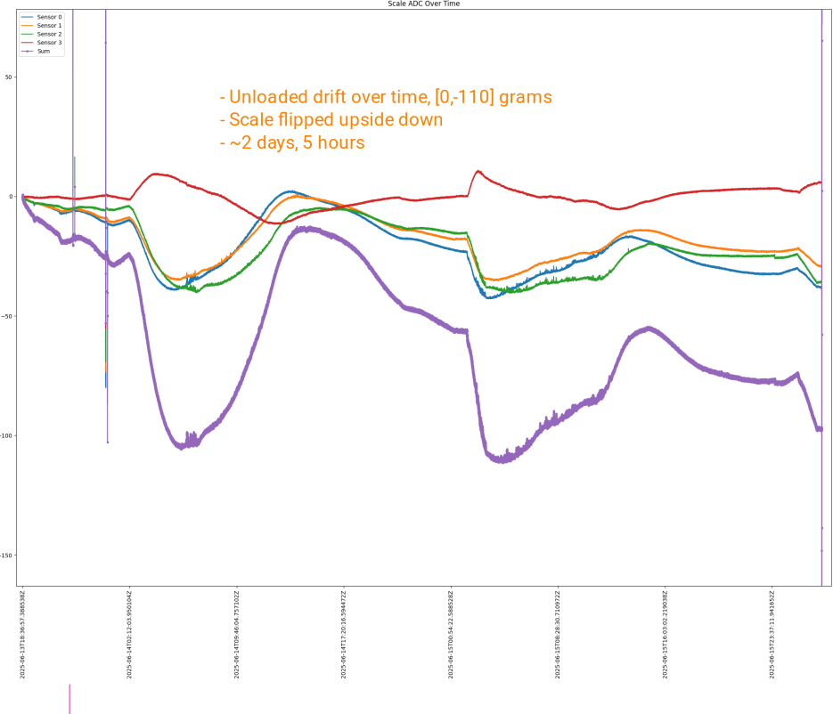

Prototyping (June 2025)
=======================

An evolution of prototyping.

Prototype #1
------------
The blue board is an Arduino mini pro 3v3. The red board is an FTDI 232RL USB<->UART board.

.. image:: binary/growbies_bug.jpg

The first prototype. Load cells and electronics mounted to the bottom of 10"x20" gardening tray.

.. image:: binary/proto0_0.jpg

Shown here is a spherical foot, a load cell and a mounting plate on the bottom of a gardening tray.

.. image:: binary/proto0_1.jpg

The electronics go into a 2 ounce tin for electromagnetic interference and dust/spray protection.
I am going for IP65 rating.

This is the first 3D-printed prototype. The spherical feet are to better float on soft terrain,
such as pea gravel. The wiring to the load sensors passes through the frame.

.. image:: binary/proto1_0.jpg

The electronics go inside the 2 ounce tin.

.. image:: binary/proto1_1.jpg

It was fun getting the 3D printing fill to work good with a sphere.

.. image:: binary/inside_spherical_foot.jpg

Growing lettuce.

.. image:: binary/proto1_2.jpg

Controls and a display were added. Unfortunately, the microcontroller was accidentally destroyed
before the LCD display could be made functional.

.. image:: binary/proto1_3.jpg

Prototype #2
------------
Functional OLED LCD. Simplified controls.

.. image:: binary/proto2_0.jpg

The electronics:

- Arduino mini pro 3v3
- FTDI 232RL USB <-> UART
- 4x HX711
- TP4056 power charging and protection
- 180mA battery

.. image:: binary/proto2_1.jpg

Testing
-------

#1: Zero Offset Drift - Initial
~~~~~~~~~~~~~~~~~~~~~~~~~~~~~~~
This is some zero offset drift testing showing 120g of drift over about 11 hours. That's not
good, I am engineering to +/- 5g for the long term time range.

.. image:: binary/3.3_hx711_drift.png

The good news is that the short term time range is very sensitive with good resolution. This is
great for manual/automated watering use cases.

Also good news is that the summing of the independent scales makes the mass output more immune to
environmental vibrations when compared to a distributed bridge scale architecture.

.. image:: binary/desk_vibrations.png

#2: Zero Offset Drift - Longer time
~~~~~~~~~~~~~~~~~~~~~~~~~~~~~~~~~~~
More zero offset drift testing was performed. Still at 3.3V running to modified hx711 boards for
2.7v excitation.

Loaded drift testing.

.. image:: binary/drift-3.3v_hx711-loaded-long_test.png

These results were not good. The goal is for the error to not exceed +/- 5g due to drifting.

#3: 5v Drift
~~~~~~~~~~~~
The load cell excitation voltage was increased from 2.7v to 4.2v. Some improvement observed in
zero offset drift for sensors 0,1 & 2. Sensor 3 is going way out of bounds.

#4: Op-amp & ADC Check
~~~~~~~~~~~~~~~~~~~~~~

In this test, the mass sensing is simplified to these four parts:

.. image:: binary/mass_sensing-4_parts.png

- #1: A voltage regulator driving the load cell sensor(s). There is an onboard 4.2 voltage
  regulator included with the hx711 board.
- #2: A load cell, please excuse the poor drawing :)
- #3: Programmable gain op-amps. In this testing, only channel A, gain 128x is being tested.\
- #4: A 24bit digital to analog converter output to
  `bit-banging <https://en.wikipedia.org/wiki/Bit_banging>`_ serial.

I would like to know what is wrong on with sensor #3. The four components were dissected in half.
This was accomplished by

- disconnecting sensor #3's load cell
- connect sensor #2 load cell output to sensor #2 & #3 hx711 input.

Shown below:

Here are the results:

.. image:: binary/op_amp-adc-check.png

The sensor 3 data matches sensor 2 data very well. This means that sensor 3 op amp & ADC are
functioning the same as sensor 2's. It is unlikely that both sensor's op-amp & ADC would be bad
and behave identically, so assume that sensor 2 & 3's op-amp & ADC are functioning properly.

This indicates that the problem is in sensor #3's voltage regulator or load cell.

#5: 1k ohm Resistor Wheatstone Bridge Stand-in
~~~~~~~~~~~~~~~~~~~~~~~~~~~~~~~~~~~~~~~~~~~~~~
A wheatstone bridge was built out of four 1k ohm resistors. It was then used in place of a load
cell for sensor #3.

.. image:: binary/resistor_standin.jpg

The results were interesting. This is the first time I have tried to use static resistors as a
stand in for a load cell. I'm not sure what to make of the data other than sensor #3 behaved
erratically.

#6: Parallel HX711 Voltage Regulators
~~~~~~~~~~~~~~~~~~~~~~~~~~~~~~~~~~~~~
Next, the voltage regulators of all hx711 boards were ran in parallel.

.. image:: binary/common_excitation_0.png

The drift of sensor 0,1 & 2 looks good. Sensor 3 does not. I suspect the voltage regulator of the
sensor 3 hx711 board is failing.

Secondary observations were made. A DC shift can be introduced through changes in the host
sampling interval, loading/unloading the scale and turning the power on/of between host samples.
All of these are likely due to heating, either in the HX711 board or in the load cell strain gages.

.. image binary/common_excitation_1.png

#7: Cross-swap Sensor #2 & #3 load cells
~~~~~~~~~~~~~~~~~~~~~~~~~~~~~~~~~~~~~~~~
The steep drift observed with sensor #3 stopped when sensor #2 & #3 load cells were swapped.
Additionally, no problem found on sensor #2 with sensor #3's load cell.

Noise observed on sensor 1.

.. image:: binary/cross_swap_load_cell.png

#8: Attempt to Repeat #6
~~~~~~~~~~~~~~~~~~~~~~~~

The cross-swap from #7 was reverted. The attempt repeat the bad drift on sensor #3 observed in
test #6 was made. The problem did not repeat.

.. image:: binary/did_not_repeat.png

I am not sure why the problem did not repeat. My leading hypothesis is a floating ground that
was fixed during the cross-swap experiment.

#9: Electrically Sum Load Cells
~~~~~~~~~~~~~~~~~~~~~~~~~~~~~~~
Here, a single HX711 board is used with the load cell differential signals electrically summed,
using an adder circuit.

.. image:: binary/adder_circuit_physical.png

`Reference <https://electronics.stackexchange
.com/questions/358105/fully-differential-amplifier-adder>`_

For four wheatstone bridge sensors and from experimentation, the resistors shown above and in the
schematic were not needed.

.. image:: binary/diff_signal_adder_zero_offset_drift_0.png

Here is a longer test of the drift.

#10: AC Excitation
~~~~~~~~~~~~~~~~~~
In this experiment, AC excitation as added. Similiar to experiment #9, 4x full bridge load cells
were used along with a single HX711 board, where the signals are electrically summed at the
op-amp input.

A maximum drift of 31g was observed over 36 hours.

I was hoping for more drift removal than what was observed. I suspect that the AC excitation is
removing thermal drift from the strain gages. I suspect that the remaining observed drift is
largely made up of physical deformation of the load cells due to temperature.

References:

- `Texas Instruments - A Basic Guide to Bridge Measurements <https://www.ti.com/lit/an/sbaa532a/sbaa532a.pdf?ts=1750655121715>`_
- `Texas Instruments - Reduce Bridge Measurement Offset and Drift Using AC Excitation Mode <https://www.ti.com/lit/ab/sbaa290a/sbaa290a.pdf?ts=1750673756912&ref_url=https%253A%252F%252Fwww.google.com%252F>`_

#12: Temperature HX711 Channel B
~~~~~~~~~~~~~~~~~~~~~~~~~~~~~~~~
A load cell was wired to sensor #1's HX711 channel B input. The load cell was mounted in a way to
minimize any stress induced variances. With this, it is intended to serve as a temperature
reference for the weigh scale.

Here is the hardware configuration:

.. image:: binary/4x_loadcell-1x_temp_b.png

A problem was encountered in which the channel A signal was affecting the channel B signal. In
fact, the signal from A was greater, by orders of magnitude, than the approximately 1kg load
placed on the channel B load cell.

#13: Temperature with Dedicated HX711
~~~~~~~~~~~~~~~~~~~~~~~~~~~~~~~~~~~~~
The same hardware was used from experiment #12. This time, The four load cells were summed
electrically at the input of sensor 1. The reference temperature load cell was input to its own
HX711 board, sensor 0.

The fixture was placed on a 3D printer heat bed. The temperature was cycle between approximately
22*C and 50*C.

Here is a temperature (DAC) vs mass (grams) plot. Whoa, that's a pretty cool plot. That's all
sorts of unpredictable though. I don't think it will be practical to use an auxiliary load cell
for temperature sensing.

#14: Mass & Temperature Planar Load Cell
~~~~~~~~~~~~~~~~~~~~~~~~~~~~~~~~~~~~~~~~
A meat thermometer was used as a temperature sensor in an attempt to correlate temperature with
mass.

First, the resistance/temperature response needed to be determined for the temperature probe.

Next, the temperature vs. resistance is plotted and a line of best fit analysis is made.

From the R^2 value, it looks like the power curve fits the best.

The probe was then put into a voltage divider circuit, shown in the circuit as R2. R2
represents the temperature probe.

R1 needs to be selected in a way to most fully use the Arduino analog input range [0,3.3] volts
in this case.

40 kohm was chosen. I think the the closest I had on hand was 44 kohm or so.

Finally, the same correlation was made, except this time temperature \*F vs. digital to analog
converted (DAC) value.

This time R^2 shoes a linear fit to be best. Placing the probe into a voltage divider linearized
the output, sweet!

Here is the fixture for mass & temperature over time for an unloaded planar, full-bridge load
cell.

3x thermal cycling [22*C, 50*C] test data:

The total change in mass was about (-60, 20) grams.

The arrows in the plat above indicate which direction the temperature is going. There is
hysteresis when going up/down in temperature. There are also hystereses observed when going in
just one direction in temperature. The width of the hysteresis was 80 grams.

The implications of this is that the mass of something being weighed can only be known to [-60,
20] grams. It would be difficult to correct the mass output with temperature sensing due to the
multiple hystereses and general non-repeatable nature.

#15: Mass & Temperature Single-ended Shear Beam Load Cell
~~~~~~~~~~~~~~~~~~~~~~~~~~~~~~~~~~~~~~~~~~~~~~~~~~~~~~~~~
The following fixture was constructed and placed on a 3D printer heat bed for thermal
conditioning testing. The probe was taped to the non-load bearing side of the load cell with
copper tape to try to thermally couple the two.

The fixture was thermally cycled between [70, 120] \*F, approximately, three times.

The total drift in mass was [2, -31] grams. There was hysteresis when going up/down in
temperature. The width of the hysteresis was approximately 5-7 grams.

The same test was performed, this time with a 798 gram load using quarters and coffee coasters. The
intent is to see if the load cell responds to temperature differently when loaded.

The fixture was thermally cycled between [70, 120] \*F, approximately, three times.

The total drift in mass observed was again, about [2,-32] grams. The width of the hysteresis
about 5-7 grams.

**Summary:**

The single-ended shear beam load cell responds to environmental temperature in a more predictable
way than the planar load cell. This is likely due to complexities introduced in the strain field
by multiple axis of warping in the planar cell. The shear beam has a simpler strain field that is
more predictable with temperature changes.

I am wondering how much of the non-repeatable, unpredictable, non-linearities could be eliminated
with a thermistor embedded into the metal of the load cell. The thermal response of the probe and
the load cell are likely different. In this experiment, they were marginally thermally coupled
using copper tape.

From these findings, the Growbies effort is going to shift to implementing a single-ended shear
beam with an integrated thermistor. Temperature correction will be made. This will provide lower
thermal drift error rates. This is important when trying to keep track of a plant growing in a
container over long periods of time with varying environmental temperatures.

