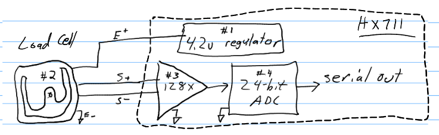

Prototyping (June 2025)
=======================

An evolution of prototyping.

Prototype #1
------------
The blue board is an Arduino mini pro 3v3. The red board is an FTDI 232RL USB<->UART board.

The first prototype. Load cells and electronics mounted to the bottom of 10"x20" gardening tray.

.. image:: binary/proto0_0.jpg

Shown here is a spherical foot, a load cell and a mounting plate on the bottom of a gardening tray.

The electronics go into a 2 ounce tin for electromagnetic interference and dust/spray protection.
I am going for IP65 rating.

.. image:: binary/proto0_2.jpg

.. image:: binary/ip65.png

This is the first 3D-printed prototype. The spherical feet are to better float on soft terrain,
such as pea gravel. The wiring to the load sensors passes through the frame.

.. image:: binary/proto1_0.jpg

The electronics go inside the 2 ounce tin.

It was fun getting the 3D printing fill to work good with a sphere.

Growing lettuce.

.. image:: binary/proto1_2.jpg

Controls and a display were added. Unfortunately, the microcontroller was accidentally destroyed
before the LCD display could be made functional.

Prototype #2
------------
Functional OLED LCD. Simplified controls.

The electronics:

- Arduino mini pro 3v3
- FTDI 232RL USB <-> UART
- 4x HX711
- TP4056 power charging and protection
- 180mA battery

.. image:: binary/proto2_1.jpg

Testing
-------

#1: Zero Offset Drift - Initial
~~~~~~~~~~~~~~~~~~~~~~~~~~~~~~~
This is some zero offset drift testing showing 120g of drift over about 11 hours. That's not
good, I am engineering to +/- 5g for the long term time range.

The good news is that the short term time range is very sensitive with good resolution. This is
great for manual/automated watering use cases.

Also good news is that the summing of the independent scales makes the mass output more immune to
environmental vibrations when compared to a distributed bridge scale architecture.

#2: Zero Offset Drift - Longer time
~~~~~~~~~~~~~~~~~~~~~~~~~~~~~~~~~~~
More zero offset drift testing was performed. Still at 3.3V running to modified hx711 boards for
2.7v excitation.

.. image:: binary/drift-3.3v_hx711-unloaded-long_test.png

Loaded drift testing.

.. image:: binary/drift-3.3v_hx711-loaded-long_test.png

These results were not good. The goal is for the error to not exceed +/- 5g due to drifting.

#3: 5v drift
~~~~~~~~~~~~
The load cell excitation voltage was increased from 2.7v to 4.2v. Some improvement observed in
zero offset drift for sensors 0,1 & 2. Sensor 3 is going way out of bounds.

.. image:: binary/drift-5v.png

#4: Op-amp & ADC Check
~~~~~~~~~~~~~~~~~~~~~~

In this test, the mass sensing is simplified to these four parts:

- #1: A voltage regulator driving the load cell sensor(s). There is an onboard 4.2 voltage
  regulator included with the hx711 board.
- #2: A load cell, please excuse the poor drawing :)
- #3: Programmable gain op-amps. In this testing, only channel A, gain 128x is being tested.\
- #4: A 24bit digital to analog converter output to
  `bit-banging <https://en.wikipedia.org/wiki/Bit_banging>`_ serial.

I would like to know what is wrong on with sensor #3. The four components were dissected in half.
This was accomplished by

- disconnecting sensor #3's load cell
- connect sensor #2 load cell output to sensor #2 & #3 hx711 input.

Shown below:

.. image:: binary/dissected.png

Here are the results:

.. image:: binary/op_amp-adc-check.png

The sensor 3 data matches sensor 2 data very well. This means that sensor 3 op amp & ADC are
functioning the same as sensor 2's. It is unlikely that both sensor's op-amp & ADC would be bad
and behave identically, so assume that sensor 2 & 3's op-amp & ADC are functioning properly.

This indicates that the problem is in sensor #3's voltage regulator or load cell.

#5: 1k ohm Resistor Wheatstone Bridge Stand-in
~~~~~~~~~~~~~~~~~~~~~~~~~~~~~~~~~~~~~~~~~~~~~~
A wheatstone bridge was built out of four 1k ohm resistors. It was then used in place of a load
cell for sensor #3.

The results were interesting. This is the first time I have tried to use static resistors as a
stand in for a load cell. I'm not sure what to make of the data other than sensor #3 behaved
erratically.

.. image:: binary/resistor_standin.png

#6: Parallel HX711 voltage regulators
~~~~~~~~~~~~~~~~~~~~~~~~~~~~~~~~~~~~~
Next, the voltage regulators of all hx711 boards were ran in parallel.

.. image:: binary/common_excitation_0.png

The drift of sensor 0,1 & 2 looks good. Sensor 3 does not. I suspect the voltage regulator of the
sensor 3 hx711 board is failing.

Secondary observations were made. A DC shift can be introduced through changes in the host
sampling interval, loading/unloading the scale and turning the power on/of between host samples.
All of these are likely due to heating, either in the HX711 board or in the load cell strain gages.

.. image binary/common_excitation_1.png

#7: Cross-swap Sensor #2 & #3 load cells
~~~~~~~~~~~~~~~~~~~~~~~~~~~~~~~~~~~~~~~~
The steep drift observed with sensor #3 stopped when sensor #2 & #3 load cells were swapped.
Additionally, no problem found on sensor #2 with sensor #3's load cell.

Noise observed on sensor 1.

#8: Attempt to Repeat #6
~~~~~~~~~~~~~~~~~~~~~~~~

The cross-swap from #7 was reverted. The attempt repeat the bad drift on sensor #3 observed in
test #6 was made. The problem did not repeat.

I am not sure why the problem did not repeat. My leading hypothesis is a floating ground that
was fixed during the cross-swap experiment.

#9: Electrically sum differential signals from load cells at op-amp input
~~~~~~~~~~~~~~~~~~~~~~~~~~~~~~~~~~~~~~~~~~~~~~~~~~~~~~~~~~~~~~~~~~~~~~~~~
Here, a single HX711 board is used with the load cell differential signals electrically summed,
using an adder circuit.

.. image:: binary/adder_circuit.png

`Reference <https://electronics.stackexchange
.com/questions/358105/fully-differential-amplifier-adder>`_

Here is a longer test of the drift.

.. image:: binary/diff_signal_adder_zero_offset_drift_1.png

#10: AC excitation
~~~~~~~~~~~~~~~~~~
In this experiment, AC excitation as added. Similiar to experiment #9, 4x full bridge load cells
were used along with a single HX711 board, where the signals are electrically summed at the
op-amp input.

A maximum drift of 31g was observed over 36 hours.

.. image:: binary/ac_excitation_0.png

I was hoping for more drift removal than what was observed. I suspect that the AC excitation is
removing thermal drift from the strain gages. I suspect that the remaining observed drift is
largely made up of physical deformation of the load cells due to temperature.

References:

- `Texas Instruments - A Basic Guide to Bridge Measurements <https://www.ti.com/lit/an/sbaa532a/sbaa532a.pdf?ts=1750655121715>`_
- `Texas Instruments - Reduce Bridge Measurement Offset and Drift Using AC Excitation Mode <https://www.ti.com/lit/ab/sbaa290a/sbaa290a.pdf?ts=1750673756912&ref_url=https%253A%252F%252Fwww.google.com%252F>`_

#12: Temperature HX711 Channel B
~~~~~~~~~~~~~~~~~~~~~~~~~~~~~~~~
A load cell was wired to sensor #1's HX711 channel B input. The load cell was mounted in a way to
minimize any stress induced variances. With this, it is intended to serve as a temperature
reference for the weigh scale.

Here is the hardware configuration:

A problem was encountered in which the channel A signal was affecting the channel B signal. In
fact, the signal from A was greater orders of magnitude than approximately a 1kg load placed on
the channel B load cell.

.. image:: binary/4x_loadcell-1x_temp_b_data.png

Next Steps & Ideas
------------------
- Test a hair dryer
- Explore the effect of adding capacitance to the parallel excitation.
- Test hx711 parallel excitation at 3.3v
- Try an external, common voltage regulator
